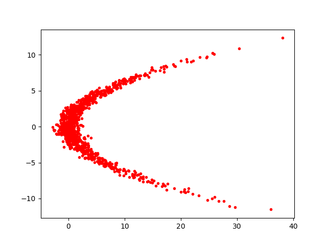
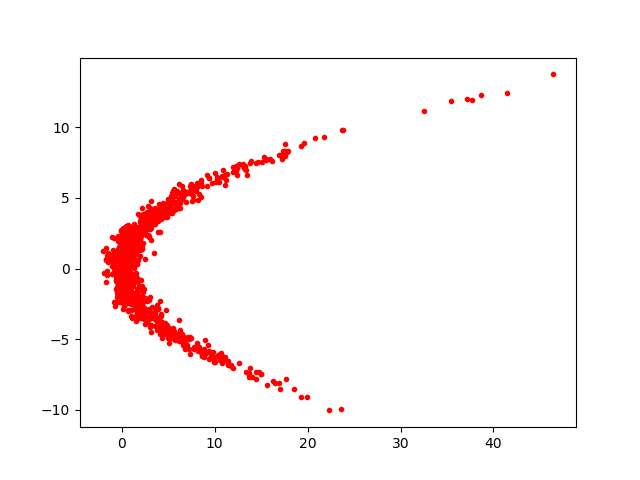

Assuming we have a target distribution $p(x_1, x_2) = \mathcal{N}(x_1|\mu=1/4x_2^2, \sigma=1) \cdot N(x_2|\mu=0, \sigma=4)$, 

We could transform an isotropic Gaussian distribution with a $K=10$ planar flows to match it

  

In this implementation, we minimize the l1 loss between $\ln q(z_K)$ and $\ln p(x)$ to match $q(z_K)$ to $p(x)$. This is different from what has been done in this [tutorial](https://blog.evjang.com/2018/01/nf1.html), in which they first draw a collection of samples $x_i \sim p(x)$, and then maximize the likelihood $\prod_{i}^n q(x_i)$ to optimize the parameters in the flows. In such an implementation, we are required to be able to evaluate the log-pdf of $q(x_i)$, which means we need to run the computation along the inverse flows from $x_i$ to its corresponding $z_0​$ in the isotropic Gaussian distribution. Since the inverse computation of planar flow is nontrival and expensive, we cannot do in that way.

​    
